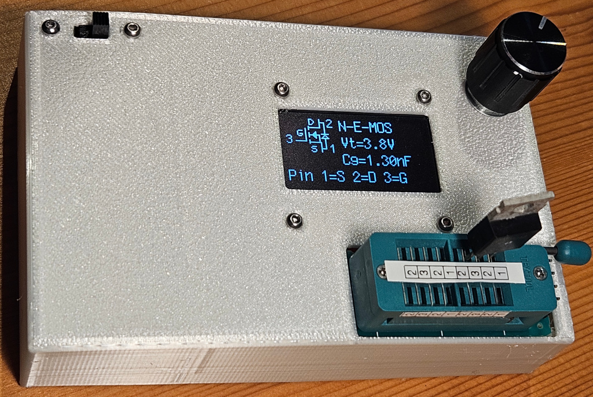
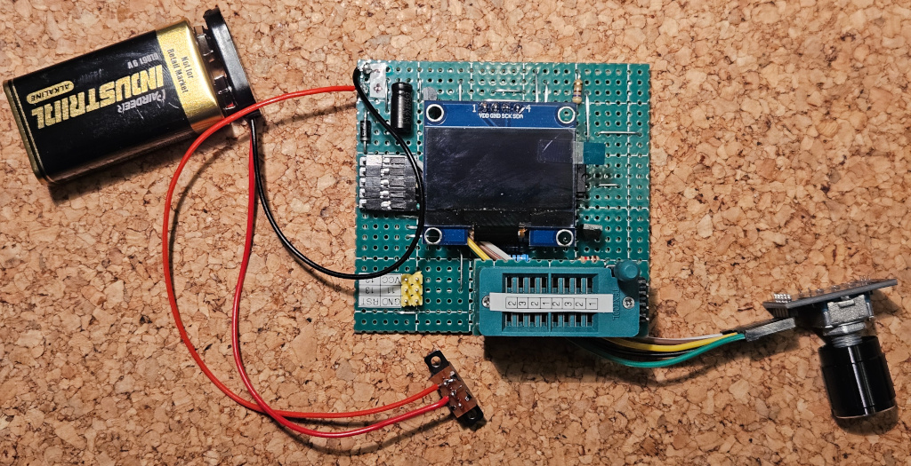
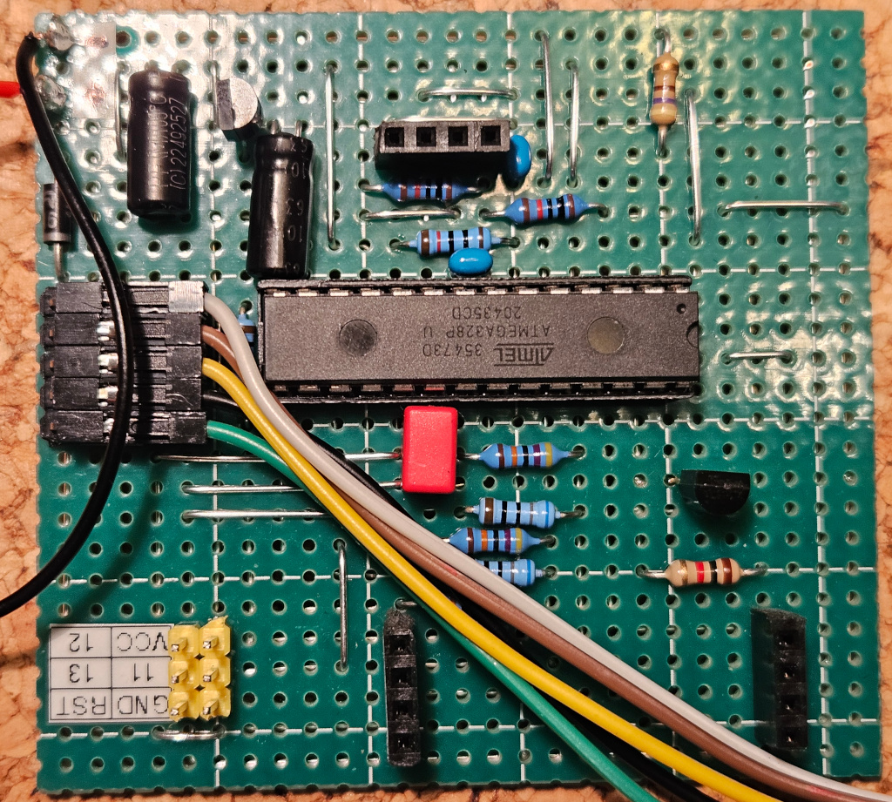
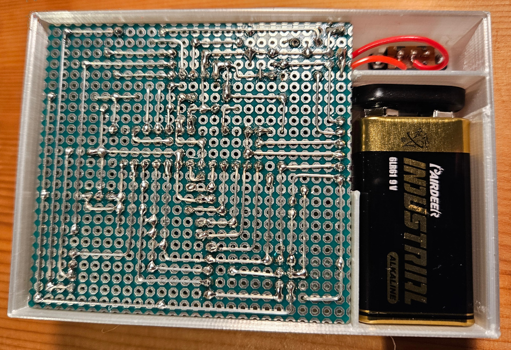
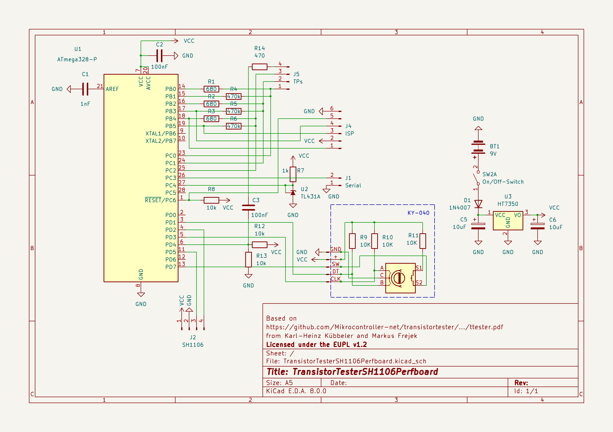
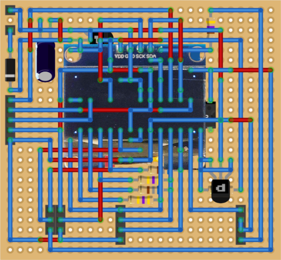
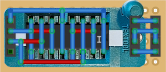

# TransistorTesterSH1106Perfboard

A battery driven TransistorTester with a SH1106 display, rotary encoder on a perfboard.

Code and idea from Karl-Heinz Kübbeler and Markus Frejek:
- https://github.com/Mikrocontroller-net/transistortester-
- https://www.mikrocontroller.net/articles/AVR_Transistortester

Thanks!









## License and copyright
My [perfboard layout](#perfboard) and [3d STL print files](#STL) are licensed under the terms of CC0 [Copyright (c) 2026 codingABI](LICENSE). 

My [schematic](#schematic) based on [ttester.pdf](https://github.com/Mikrocontroller-net/transistortester/blob/master/Doku/trunk/pdftex/german/ttester.pdf) and is licensed under the European Union Public License v1.2 (EUPL v1.2), because Karl-Heinz Kübbeler at https://github.com/kubi48/TransistorTester-source use this license. See the [eupl_v1.2_en.pdf](Schematic/eupl_v1.2_en.pdf) for details.

The code and idea are from Karl-Heinz Kübbeler and Markus Frejek:
- https://github.com/Mikrocontroller-net/transistortester
- https://www.mikrocontroller.net/articles/AVR_Transistortester

## Appendix

### Code
I used the original code from https://github.com/Mikrocontroller-net/transistortester and changed only the [Makefile](Code/Makefile) under Software\trunk\mega328_ssd1306I2C for my needs:
- CFLAGS += -DWITH_ROTARY_CHECK
- CFLAGS += -DWITH_ROTARY_SWITCH=2
- UI_LANGUAGE = LANG_GERMAN
- #CFLAGS += -DPOWER_OFF
- #CFLAGS += -DBAT_CHECK

After compiling I flashed the mega328_ssd1306I2C.hex and mega328_ssd1306I2C.eep to the ATmega328P microcontroller with an Arduino Nano (ArduinoISP.ino with #define USE_OLD_STYLE_WIRING) working as a "ISP"
```
avrdude.exe -C avrdude.conf -p atmega328p -c stk500v1 -P COM7 -b 19200 -B 10 -U lfuse:w:0xE2:m -U hfuse:w:0xD9:m -U efuse:w:0xFF:m
avrdude.exe -C avrdude.conf -p atmega328p -c stk500v1 -P COM7 -b 19200 -U flash:w:mega328_ssd1306I2C.hex:i -U eeprom:w:mega328_ssd1306I2C.eep:a
```

### Schematic



[Kicad schematic](Schematic/TransistorTesterSH1106Perfboard.kicad_sch)

#### Components

| Component  | Reference | Comment |
| ------------- | ------------- | --- |
| 680 | R1, R2, R3 | Resistor, <= 1%, <= 0.25W |
| 470K | R4, R5, R6 | Resistor, <= 1%, <= 0.25W |
| 470 | R14 | Resistor, <= 5%, <= 0.25W |
| 1K | R7 | Resistor (1-2K should work), <= 5%, <= 0.25W |
| 10K | R8, R12, R13 | Resistor, <= 5%, <= 0.25W |
| TL431A | U2 | 2.5V Voltage reference |
| 1nF | C1 | Film capacitor, <= 16V |
| 100nF | C2, C3 | Ceramic capacitor, <= 16V |
| 10uF | C4, C5 | Electrolytic capacitor, <= 16V |
| 1N4007 | D1 | Reverse‑polarity protection diode |
| SH1103 | J2 | I2C OLED display |
| KY-040 | | Rotary encoder |
| HT7350 | U3 | 5V Voltage regulator |
| ATmega328PU | U1 | Microcontroller (In 8 MHz-RC mode) |
| 9V Battery | BT1 | |

### Perfboard





- Red lines = Wire bridges on top side
- Blue lines = Wire connections on the bottom (solder) side

[Fritzing layout](Perfboard/TransistorTesterSH1106Perfboard.fzz)

### STL

- [Top](STL/TransistorTesterTop.stl)
- [Bottom](STL/TransistorTesterBottom.stl)

All STL files were created and designed with Tinkercad https://www.tinkercad.com

Printer settings used on my Anycubic Vyper (Thank you **https://github.com/m-holler**!): 
- Nozzle: 0.4mm
- Layer height: 0.15mm
- Filament: PLA+ silk

### Error: verification error, first mismatch at byte 0x7800

When trying to flash the ATmega328 I got the error
```
avrdude.exe: verifying ...
avrdude.exe: verification error, first mismatch at byte 0x7800
             0x0c != 0xf1
avrdude.exe: verification error; content mismatch
```

To resolve the error, I had to clear lockbits
```
avrdude.exe -C avrdude.conf -p atmega328p -c stk500v1 -P COM7 -b 19200 -B 10 -U lock:w:0x3F:m   
```

### SH1106 display

The SH1106 I2C display is not supported by the https://github.com/Mikrocontroller-net/transistortester (at least for Version <= 1.13k), but works with the SSD1306 code (For an explanation why, see https://github.com/Mikrocontroller-net/transistortester/issues/16). 

I use no pullup resistors to VCC (=5V) for the logic lines SDA/SCL because the
- logic lines for the SH1106 are only 1.85-3.5V tolerant
- SH1106 seems to pullup the logic lines to 3.3V by itself
- [code](https://github.com/Mikrocontroller-net/transistortester) seems to set SDA/SCL only to 0V or open collector

### Tests

#### Rotary check

Rotary encoder pins DT, SW, CLK must be connected to TP1, TP2 and TP3 (Order does not matter) and GND must be connected to the TransistorTesterSH1106Perfboards ground

#### Frequency generator

Output for the Frequency generator is TP2

#### Frequency counter

Input for frequency counter is TP4

#### 10-bit PWM

Output for the PWM (at 7.8 KHz) is TP2

### Calibration

For a calibration I use
- a soldered bridge to connect TP1, TP2 and TP3
- 10 nF Ceramic capacitor
- 100 nF Ceramic capacitor (I have no larger film or ceramic capacitor)

### Serial output

Serial output can be used with 9600 baud and 5V logic level.